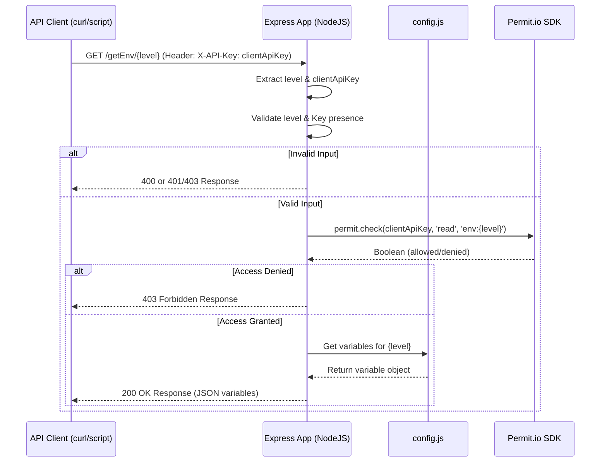

# Architecture Document: Env Var Hosting Service Demo (v0.1)

**Version:** 0.1.1

**Date:** 2025-04-25

**Status:** Draft

## 1. Introduction

### 1.1 Purpose

This document outlines the architecture for a centralized environment variable service. The service aims to address the challenges developers face with managing `.env` files, such as accidental commits, insecure sharing, and incorrect environment assignment[cite: 1]. The primary goal of this version (v0.1) is to validate the technical feasibility of the service using NodeJS/Express and [Permit.io](http://permit.io/) for access control[cite: 1]. It will also showcase [Permit.io](http://permit.io/)'s role-based access control capabilities for different environments (Dev, Staging, Prod)[cite: 1].

### 1.2 Scope

The architecture defined in this document covers the backend API service, focusing on:

- A NodeJS/Express backend API[cite: 1].
- A single API endpoint for retrieving environment variables[cite: 1].
- [Permit.io](http://permit.io/) integration for authorization[cite: 1].
- Configuration management using `config.js`[cite: 1].
- Initial project setup and dependencies.

This document does not include:

- UI for managing users, roles, permissions, or environment variables[cite: 1].
- Client-side SDK/Library[cite: 1].
- User management functionality within the service[cite: 1].
- Advanced [Permit.io](http://permit.io/) features (ABAC, ReBAC, etc.)[cite: 1].
- Environment variable versioning or history[cite: 1].
- Automated testing framework setup[cite: 1].
- Deployment strategy and infrastructure setup[cite: 1].
- Database integration[cite: 1].

### 1.3 Disclaimer

Implementation findings may necessitate updates to this Architecture Document and/or the PRD.

## 2. Architectural Goals and Constraints

### 2.1 Goals

The architecture is designed to meet the following goals:

- **Functionality:** Implement the core functionality of retrieving environment variables based on user authorization[cite: 1].
- **Security:** Secure access to environment variables using [Permit.io](http://permit.io/)'s role-based access control[cite: 1].
- **Clarity:** Provide a clear and understandable architecture for development and maintenance.
- **Extensibility:** While v0.1 is focused on feasibility, the architecture should allow for future extensibility (e.g., adding user management, more advanced authorization features).

### 2.2 Constraints

The architecture is subject to the following constraints:

- **Technology:** Use NodeJS/Express for the backend and [Permit.io](http://permit.io/) for authorization[cite: 1].
- **Storage:** Environment variables are stored in `config.js` (for v0.1)[cite: 1].
- **Authorization:** Manual configuration of users, roles, resources, and permissions in [Permit.io](http://permit.io/)[cite: 1].
- **Scope:** v0.1 is a demo; scalability, maintainability, and advanced features are out of scope[cite: 1].
- **Testing:** Automated testing is explicitly out of scope for v0.1[cite: 1].

## 3. Architectural Representation / Views

### 3.1 High-Level Architecture

The service follows a simple monolithic style[cite: 1].

### 3.2 Component View

The main components of the service are:

- **API Endpoint (`/getEnv/:environment_level`)**: Handles incoming requests, extracts parameters, performs authorization checks, and returns environment variables.
- **Permit.io SDK**: Integrates with the Permit.io service to authorize user access.
- **Configuration (`config.js`)**: Stores environment variables (for v0.1).

Code snippet

`C4Component
    [API Endpoint] <<Component>>
    [Permit.io SDK] <<Library>>
    [Configuration] <<File>>

    [API Endpoint] -->> [Permit.io SDK] : Authorizes access
    [API Endpoint] -->> [Configuration] : Retrieves variables`

### 3.3 Data View

- **Data Entities:** The service manages environment variables, organized by environment level (dev, staging, prod).
- **Database Technology:** No database is used in v0.1; environment variables are stored in `config.js`.
- **Access Strategy:** Direct access to `config.js` within the API endpoint. No specific data access pattern is implemented due to the simplicity of v0.1.
- **Data Models:**

JavaScript

   `// Example config.js
   module.exports = {
     dev: { DB_HOST: 'dev.db.local', API_KEY: 'dev123' },
     staging: { DB_HOST: 'staging.db.internal', API_KEY: 'staging456' },
     prod: { DB_HOST: 'prod.db.public', API_KEY: 'prod789' }
   };`

### 3.4 Deployment View

- **Target Environment:** The PRD does not specify a target environment. It could be anything that can run a NodeJS application (e.g., Vercel, AWS Lambda, a basic server).
- **CI/CD:** No CI/CD strategy is defined in v0.1; deployment is handled manually.

## 4. Initial Project Setup (Manual Steps)

The following manual steps are required to set up the project:

1. **Initialize NodeJS project:**Bash
This command initializes a new NodeJS project with default settings.
    
    `npm init -y`
    
2. **Install dependencies:**Bash
This command installs the necessary packages: Express for the web framework, Permit.io SDK for authorization, and dotenv for managing environment variables.
    
    `npm install express permitio dotenv`
    
3. **Set up Express server:**
Create `server.js` (or `app.js`) and add basic server code with a health check endpoint (`/`).
4. **Create `config.js`:**
Create a file to store environment variables.
5. **Populate `config.js`:**
Add sample environment variables for dev, staging, and prod.
JavaScript
    
    `// Example config.js
    module.exports = {
      dev: { DB_HOST: 'dev.db.local', API_KEY: 'dev123' },
      staging: { DB_HOST: 'staging.db.internal', API_KEY: 'staging456' },
      prod: { DB_HOST: 'prod.db.public', API_KEY: 'prod789' }
    };`
    
6. **Configure Permit.io SDK:**
Initialize the Permit.io SDK in `server.js`, using the API key from environment variables (managed by dotenv).

## 5. Technology Stack

The technology stack for this service is:

- **Language:** NodeJS
- **Framework:** Express 4.x
- **Authorization:** Permit.io SDK (latest)
- **Config Management:** `config.js`
- **Env Var Management:** dotenv (latest)
- **API Testing:** curl / Postman (N/A)

We mandate the following specific versions:

- NodeJS: LTS (e.g., 20.x)
- Express: 4.x
- Permit.io SDK: latest
- dotenv: latest

This version policy ensures consistency and compatibility.

## 6. Patterns and Standards

### 6.1 Architectural Patterns

- **Monolithic Architecture:** The service is a single application, suitable for the demo's scope.

### 6.2 API Design

- **Style:** REST
- **Conventions:**
    - Naming: Use descriptive and consistent naming for endpoints (e.g., `/getEnv/:environment_level`).
    - Versioning: Not implemented in v0.1, but consider `/api/v1/getEnv/:environment_level` for future versions.
    - Authentication: API key in the `X-API-Key` header.
- **Format:** JSON for requests and responses.

### 6.3 Coding Standards

- **Guide:** Airbnb JavaScript Style Guide (or similar, specify a specific guide).
- **Formatter:** Prettier.
- **Linter:** ESLint with recommended configuration.
- **Naming:**
    - Files: `camelCase.js` for JavaScript files.
    - Variables: `camelCase` for variables, `PascalCase` for classes.
    - Classes: `PascalCase` for classes.
- **Test Files:** Place test files (`.test.js`) in a `/tests` directory at the project root.

### 6.4 Error Handling

- **Strategy:**
    - Logging: Log errors with sufficient detail (timestamp, error message, stack trace).
    - Propagation: Propagate errors to the client with appropriate HTTP status codes (400, 401, 403, 500).
    - Response Format: Use a consistent error response format:
    JSON
        
        `{
          "error": "Error message."
        }`
        

### 6.5 Folder Structure

`env-share-demo/
├── node_modules/
├── .env               # Stores PERMIT_API_KEY (added to .gitignore)
├── .gitignore
├── config.js          # Hardcoded environment variables
├── package.json
├── package-lock.json
└── server.js          # Express app setup, routes, Permit.io logic
└── tests/             # Test files
    └── server.test.js`

- Conventions:
    - Component Organization: Not applicable for v0.1 (no components).
    - Module Organization: Group related functionality into separate files (e.g., `routes.js`, `auth.js`) as the project grows.

## 7. Testing Strategy

- **Required Types:** Unit tests are the only relevant type for v0.1.
- **Frameworks:** Jest v29.x (or latest 29.x)
- **Coverage:** Target >=85% code coverage, enforced in CI (not applicable for v0.1).
- **Standards:**
    - AAA (Arrange-Act-Assert) pattern.
    - Setup/teardown functions (`beforeEach`, `afterEach`) for test setup and cleanup.
    - Mocking for external dependencies (e.g., Permit.io SDK calls).

## 8. Core AI Agent Rules

These rules are intended for AI agents assisting with development:

1. Always place unit tests (`.test.js`) adjacent to the source file and maintain >=85% coverage. (Not applicable for v0.1, but prepare for future)
2. Adhere strictly to the Prettier configuration for code formatting.
3. Use `camelCase.js` for filenames.
4. Use `camelCase` for variables and `PascalCase` for classes.
5. Ensure JSDoc/TSDoc comments for all exported entities (functions, classes, variables).
6. Follow the DRY (Don't Repeat Yourself) principle; abstract reusable logic.
7. Handle errors gracefully; log them and provide informative error messages to the client.
8. Prioritize security best practices (e.g., input validation, secure storage of secrets).
9. Keep code clean and readable; use meaningful names and comments.
10. Follow the API design conventions defined in this document.

## 9. Security Considerations

- **Authentication:** API keys are used for authentication. Ensure HTTPS is used in production to protect keys during transmission.
- **Authorization:** Permit.io is used for role-based access control. Roles (Dev, Staging, Prod) and permissions (read) are manually configured in Permit.io.
- **Input Validation:** Validate the `environment_level` parameter (`dev`, `staging`, `prod`).
- **Data Security:** For v0.1, the primary security concern is protecting the API key. In future versions, consider encryption-at-rest for environment variables if stored in a database.
- **Vulnerabilities:** Address common web application vulnerabilities (e.g., injection, XSS) in future versions.

## 10. Architectural Decisions

- **Choice of NodeJS/Express:** Selected for rapid development and familiarity. Consider other technologies (e.g., Go, Python/FastAPI) for production based on performance and scalability needs.
- **config.js for v0.1:** A simple solution for the demo. A database (e.g., PostgreSQL, MongoDB) is recommended for production to handle scalability and security.
- **Manual Permit.io Configuration:** Acceptable for the demo's scope. Automate role/permission management in production.
- **No Automated Testing in v0.1:** Acknowledge the risk and prioritize testing in future versions.

## 11. Glossary

- **PRD:** Product Requirements Document.
- **API:** Application Programming Interface.
- **SDK:** Software Development Kit.
- **RBAC:** Role-Based Access Control.
- **ABAC:** Attribute-Based Access Control.
- **ReBAC:** Relationship-Based Access Control.
- **LTS:** Long-Term Support (version).
- **CI/CD:** Continuous Integration/Continuous Deployment.
- **MVP:** Minimum Viable Product.